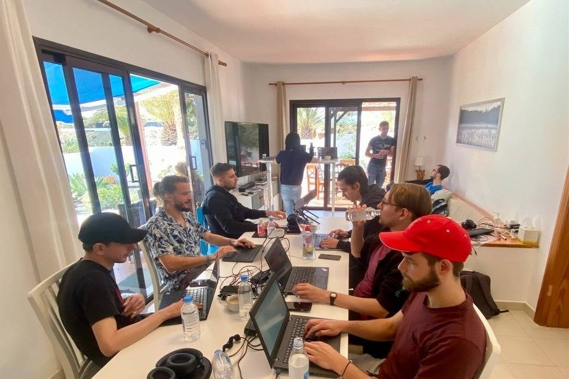

# NixOS Ocean Sprint 2022/2

|               |                                                                         |
| ------------- | ------------------------------------------------------------------------|
| What          | A week of intense hacking on Nix near the ocean.                        |
| When          | 21/11/2022 - 25/11/2022 (Mon - Fri)                                     |
| Where         | [Villa with FTTH on Lanzarote, Canary Islands](https://house.niteo.co/) |
| Who           | ~20 developers                                                          |

**Table Of Contents**

After [the successful sprint in 2021](https://blog.cachix.org/posts/2021-12-17-nixos-ocean-sprint-wrap-up/) and [2022/1](https://niteo.co/blog/oceansprint-2022), we’re doing the third sprint! 😻

## Location

[Costa Tequise, Lanzarote](https://goo.gl/maps/etSV5TSRLdFtDAX67)

The sprint will take place outside under pavilion tents (for sunshine protection) in a villa with a pool. 

Withing a 5 minute walk you can reach:

- one of the best beaches in Lanzarote, where you can swim, jog, snorkel, SUP, surf and windsurf,
- a local supermarket that is open every day from 8AM to 10PM,
- a pharmacy and a bakery,
- 5km long beachside promenade with free outside gyms,
- a steakhouse, a burger joint and an authentic Spanish tapas tavern,
- an assortment of other various cafes, pubs and bars, restaurants, etc.

## Accommodation

Once you are registered for the sprint, we'll get everyone the location of the villa and local contacts to organize the booking of nearby villas that cost ~200 EUR per person per week.

If you are planning to come with your family and/or stay longer, [Nejc Zupan](https://twitter.com/nzupan) has written a [remote worker's guide to Lanzarote](https://github.com/zupo/awesome-lanzarote).

## Food

We'll organize catering (breakfast and lunch) during the sprint. 

There are a ton of options for dinners in nearby restaurants.

## Registration

[Fill out the form to apply](https://886ae3fg27i.typeform.com/to/AeyCUuha).

## Topics

To be determined once registration closes based on attendees interest.

## Travel

The best way to travel is [via a plane to Lanzarote airport](https://www.google.com/travel/flights/search?tfs=CBwQAhojagwIAxIIL20vMDk0N2wSCjIwMjEtMTEtMjdyBwgBEgNBQ0UaI2oHCAESA0FDRRIKMjAyMS0xMi0wM3IMCAMSCC9tLzA5NDdscAGCAQsI____________AUABSAGYAQE). It's also possible to fly to other island airports and then take a ferry (Fuertaventura is closest being 30min away).

## Stuff to do on Lanzarote

- First-class surfing location with [verified instructors](http://www.watermanlanzarote.com/)
- Kitesurfing and windsurfing
- [Paragliding](https://www.famaraiso.es/)
- Visiting the Timanfaya vulcano and eating fish grilled on lava
- [Cycling and mountain biking](https://www.tripadvisor.com/Attractions-g187477-Activities-c61-t214-Lanzarote_Canary_Islands.html)
- Vulcano hiking
- [Culture](https://en.wikipedia.org/wiki/C%C3%A9sar_Manrique)
- Gastronomy
- Sailing
- Cave sightseeing
- Diving

## Sponsoring

We're looking for sponsors to cover expenses such as venue, catering, pavilion tents rental, T-shirt printing, LTE access points for backup. Please help us make this a productive event by chipping in, so we can focus on coding instead of grocery shopping and cooking. Our target budget is 6000 EUR. Reach out to [sponsors@oceansprint.org](mailto:sponsors@oceansprint.org).

[Sponsor levels](https://www.notion.so/7c23d75fffae46eca62f94393c714fe1)

### Sponsors

### Gold

### Silver

### Bronze

.png)

_(1).svg)

### Organizers

 - Nix binary cache hosting](assets/2022-2/logo-small.png)

[cachix.org](https://cachix.org/) - Nix binary cache hosting

 - Zero-trust device monitoring for remote teams](assets/2022-2/logo_copy.png)

[Pareto Security](https://paretosecurity.com) - Zero-trust device monitoring for remote teams

## Participants

- Jezen Thomas
- Johannes Kirschbauer
- David Hauer
- Marton Boros
- Ferenczy Péter
- David Buchanan
- Alejandro Sanchez Medina
- Max Headroom
- Andrea Ciceri
- Sander Melnikov
- Robert Hensing
- Bernardo Meurer Costa
- Vo Minh Thu
- Julian Stecklina
- Niklas Sturm
- Jacek Galowicz
- José María Landa Chávez
- Ryan Lahfa
- Paul Härle
- Arian van Putten
- Florian Klink

## Organizers

- Domen Kožar, long time contributor to NixOS, organizer of Zidanca Sprint
- Nejc Zupan, recently converted NixOS evangelist, organizer of Sauna Sprint
- Florian Friesdorf, long time contributor to NixOS

## COVID-19

It's required that you are vaccinated before coming to the sprint.

We will be staying outside most of the time. We'll be renting a pavilion tent for protection against the sun and the unfortunate droplet of rain. 

The temperature drops to a minimum of 15 C outside during the night so it's possible to have windows open.

Spain takes the pandemic very seriously, make sure to check up to date requirements before traveling.
