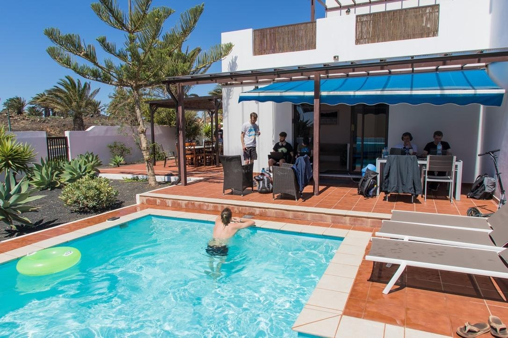
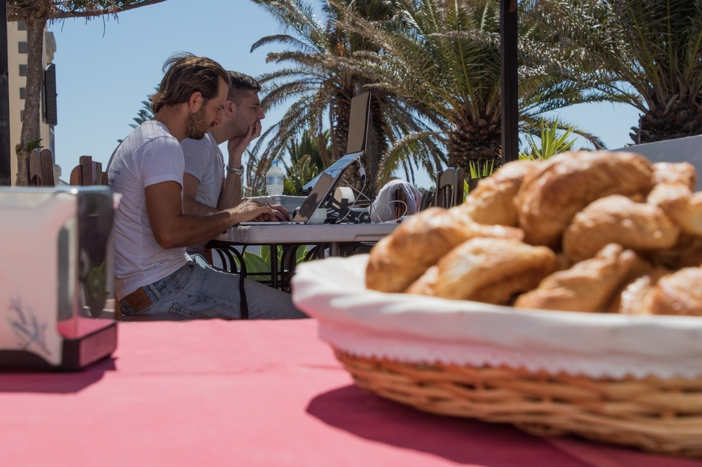
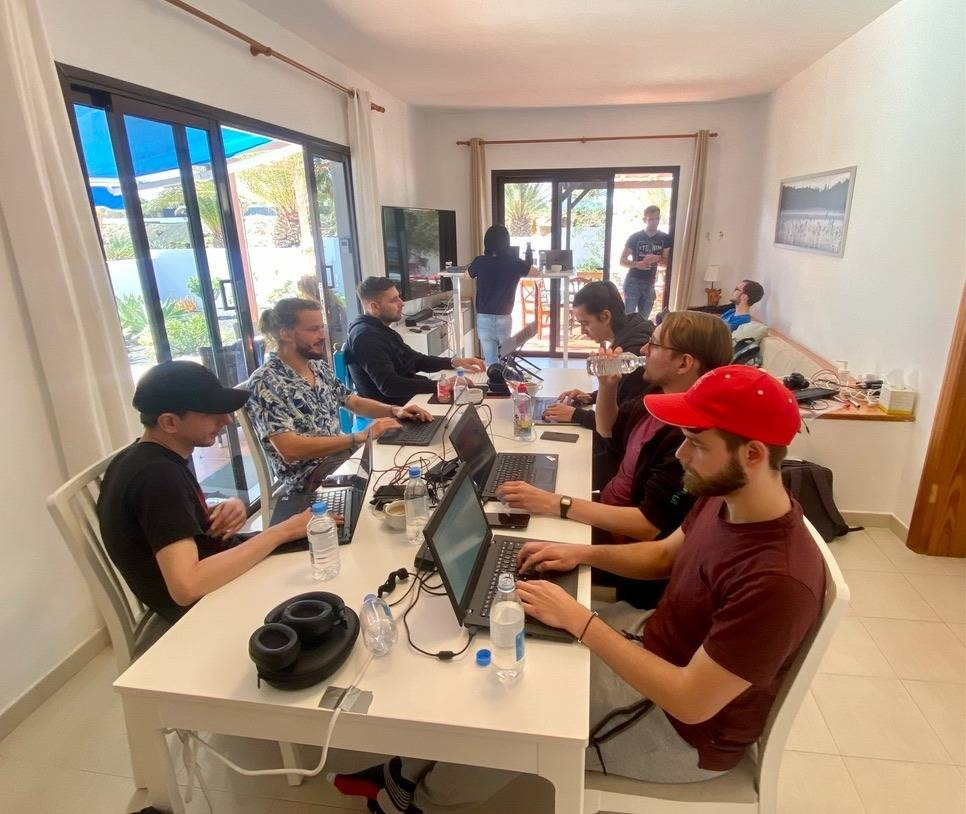
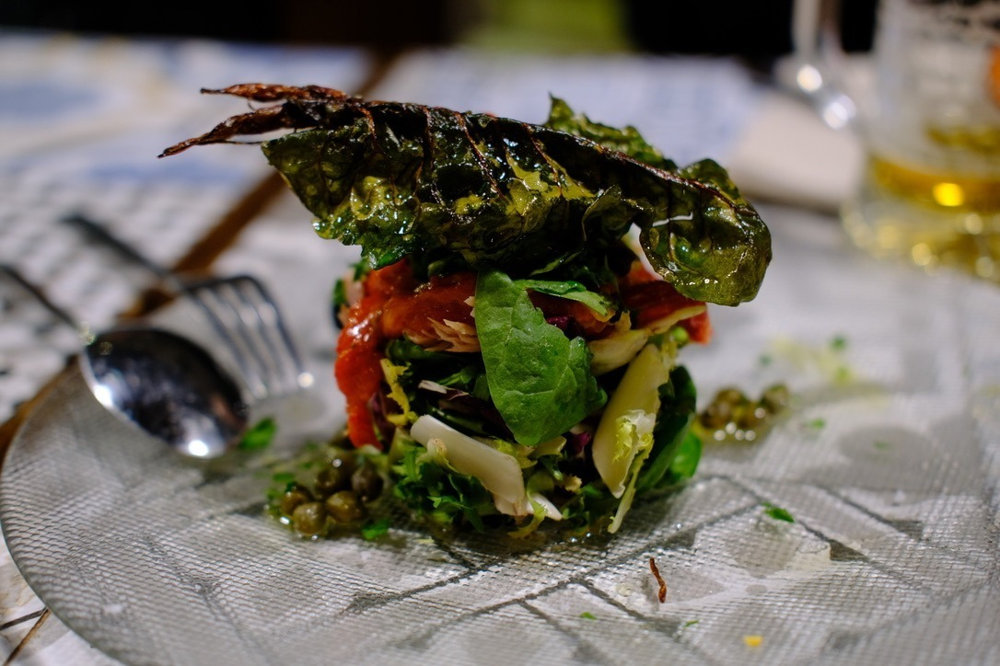
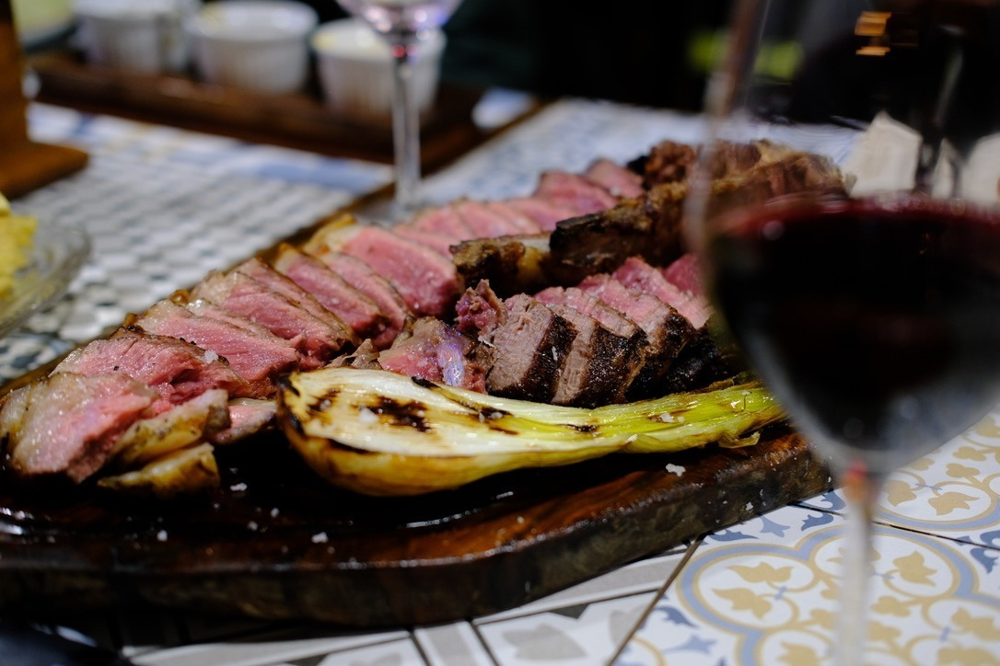
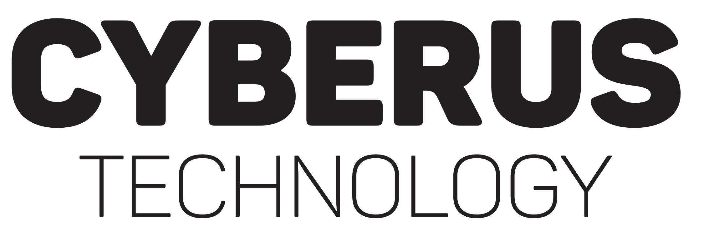

# Ocean Sprint 2025

*What*

:    A week of intense hacking [on Nix](https://nix.dev) near the ocean.

*When*
:    16/03/2025 - 21/03/2025 (Sun - Fri)

*Where*
:    [Villa with FTTH on Lanzarote, Canary Islands.](https://house.niteo.co/)

*Who*
:    ~30 developers.

## 📍 Location

[Niteo House, Costa Tequise, Lanzarote]([https://goo.gl/maps/etSV5TSRLdFtDAX67](https://maps.app.goo.gl/eoCiZ5YNsk9iyxWq7))

The sprint will take place outside under pavilion tents (for sunshine protection) in a villa with a pool.

Within a 5 minute walk you can reach:

- one of the best beaches in Lanzarote, where you can swim, jog, snorkel, SUP, surf and windsurf,
- a local supermarket that is open every day from 8AM to 10PM,
- a pharmacy and a bakery,
- 5km long beachside promenade with free outside gyms,
- a steakhouse, a burger joint and an authentic Spanish tapas tavern,
- an assortment of other various cafes, pubs and bars, restaurants, etc.

## 🏘️ Accommodation

Once you are approved participant for the sprint, we'll get everyone to a shared communication room to help organize accomodation.

Note that the accomodation is not covered by the sprint budget.

If you are planning to come with your family and/or stay longer, [Nejc Zupan](https://twitter.com/nzupan) has written a [remote worker's guide to Lanzarote](https://github.com/zupo/awesome-lanzarote).

See [Accomodations](./accomodation.md) for a list of suggestions.

## 🍲 Food

We'll organize catering (breakfast and lunch) during the sprint, which is paid by the sponsors.

There are a ton of options for dinners in nearby restaurants.

## 🔥 Registration

[Fill out the form to apply](https://app.formbricks.com/s/cm2ambioh0002ded5b0ymqet3).

The deadline is 17th December, you'll be notified if you're part of the sprint a few days later.

## 🧵 Topics

To be determined once registration closes based on attendees interest.

## 🛬 How to get here

The best way to travel is [via a plane to Lanzarote airport](https://www.flightconnections.com/flights-to-lanzarote-arrecife-ace).

Flights from other Canary Islands (Tenerife/Gran Canaria) are cheap. Flights from Madrid and Barcelona are even cheaper, around 20 EUR.

From the Lanzarote airport you can take a taxi to the venue, they have a flat rate and it should be around 20-25 EUR.

[Renting a car](https://autoreisen.com/) is usually quite cheap, around 200-350 eur for the week.

## 🥳 Stuff to do on Lanzarote

- First-class surfing location with [verified instructors](http://www.watermanlanzarote.com/)
- Kitesurfing and windsurfing
- Wingfoiling
- Yoga
- [Paragliding](https://www.famaraiso.es/)
- Visiting the Timanfaya vulcano and eating fish grilled on lava
- [Cycling and mountain biking](https://www.tripadvisor.com/Attractions-g187477-Activities-c61-t214-Lanzarote_Canary_Islands.html)
- Vulcano hiking
- [Culture](https://en.wikipedia.org/wiki/C%C3%A9sar_Manrique)
- Gastronomy
- Sailing
- Cave sightseeing
- Diving

See [Activities](./activities.md) for the full list.

## 🧑 Participants

- [@adisbladis](https://github.com/adisbladis)
- [@adrian-gierakowski](https://github.com/adrian-gierakowski)
- [@aforemny](https://github.com/aforemny)
- [@arianvp](https://github.com/arianvp)
- [@bew](https://github.com/bew)
- [@blitz](https://github.com/blitz)
- [@brainrake](https://github.com/brainrake)
- [@britter](https://github.com/britter)
- [@collinarnett](https://github.com/collinarnett)
- [@edef1c](https://github.com/edef1c)
- [@flokli](https://github.com/flokli)
- [@fricklerhandwerk](https://github.com/fricklerhandwerk)
- [@hsjobeki](https://github.com/hsjobeki)
- [@sandydoo](https://github.com/sandydoo)
- [@joshheinrichs-shopify](https://github.com/joshheinrichs-shopify)
- [@JulienMalka](https://github.com/JulienMalka)
- [@katexochen](https://github.com/katexochen)
- [@Kranzes](https://github.com/Kranzes)
- [@L-as](https://github.com/L-as)
- [@ma27](https://github.com/ma27)
- [@mightyiam](https://github.com/mightyiam)
- [@mschwaig](https://github.com/mschwaig)
- [@multivac61](https://github.com/multivac61)
- [@nikstur](https://github.com/nikstur)
- [@RaitoBezarius](https://github.com/RaitoBezarius)
- [@roberth](https://github.com/roberth)
- [@SomeoneSerge](https://github.com/SomeoneSerge)
- [@tfc](https://github.com/tfc)
- [@vkryachko](https://github.com/vkryachko)
- [@willibutz](https://github.com/willibutz)

## 💙 Sponsors

We're looking for sponsors to cover expenses such as venue, catering, T-shirt printing and some of the activities.

Please help us make this a productive event by chipping in, so we can focus on coding instead of grocery shopping and cooking.

Our target budget is 15000 EUR. Reach out to [sponsors@oceansprint.org](mailto:sponsors@oceansprint.org).

| Level      | Contribution (EUR) | Perks                        |
|------------|--------------------|--------------------------------------------------------------------------------------------|
| Gold       | 4000               | Company + Large logo on the T-shirt, 2 total reserved seats, shoutout during dinner, SWAG. |
| Company    | 1500               | Individual + Logo on the T-shirt, company name on name tag + 1 reserved seat.              |
| Individual | 500                | Logo on the website.                                                                       |

### 🏆 Gold

{: style="width:400px; margin:20px"}
{: style="width:400px; margin:20px"}
{: style="width:400px; margin:20px"}
{: style="width:400px; margin:20px"}
{: style="width:400px; margin:20px"}
{: style="width:400px; margin:20px"}

### 🏢 Company

{: style="width:200px; margin:20px"}
{: style="width:200px; margin:20px"}
{: style="width:200px; margin:20px"}
{: style="width:200px; margin:20px"}
{: style="width:200px; margin:20px"}

## 🎖️ Organizers

- Domen Kožar, long time contributor to NixOS, organizer of Zidanca Sprint
- Nejc Zupan, recently converted NixOS evangelist, organizer of Sauna Sprint
