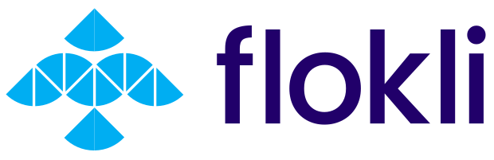

# NixOS Ocean Sprint 2023

*What*

:    A week of intense hacking [on Nix](https://nix.dev) near the ocean.

*When*          
:    16/10/2023 - 20/10/2023 (Mon - Fri)  

*Where*
:    [Villa with FTTH on Lanzarote, Canary Islands.](https://house.niteo.co/)

*Who* 
:    ~30 developers.

## 📍 Location

[Costa Tequise, Lanzarote](https://goo.gl/maps/etSV5TSRLdFtDAX67)

The sprint will take place outside under pavilion tents (for sunshine protection) in a villa with a pool.

Withing a 5 minute walk you can reach:

- one of the best beaches in Lanzarote, where you can swim, jog, snorkel, SUP, surf and windsurf,
- a local supermarket that is open every day from 8AM to 10PM,
- a pharmacy and a bakery,
- 5km long beachside promenade with free outside gyms,
- a steakhouse, a burger joint and an authentic Spanish tapas tavern,
- an assortment of other various cafes, pubs and bars, restaurants, etc.

## 🏘️ Accommodation

Once you are approved participant for the sprint, we'll get everyone to a shared communication room to help organize accomodation.

Note that the accomodation is not covered by the sprint budget.

If you are planning to come with your family and/or stay longer, [Nejc Zupan](https://twitter.com/nzupan) has written a [remote worker's guide to Lanzarote](https://github.com/zupo/awesome-lanzarote).

See [Accomodations](./accomodation.md) for a list of suggestions.

## 🍲 Food

We'll organize catering (breakfast and lunch) during the sprint, which is paid by the sponsors.

There are a ton of options for dinners in nearby restaurants.

## 🔥 Registration

Closed.

## 🧵 Topics

To be determined once registration closes based on attendees interest.

## 🛬 Travel

The best way to travel is [via a plane to Lanzarote airport](https://www.google.com/travel/flights/search?tfs=CBwQAhojagwIAxIIL20vMDk0N2wSCjIwMjEtMTEtMjdyBwgBEgNBQ0UaI2oHCAESA0FDRRIKMjAyMS0xMi0wM3IMCAMSCC9tLzA5NDdscAGCAQsI____________AUABSAGYAQE). 

It's also possible to fly to other island airports and then take a short flight or a ferry (Fuertaventura is closest being 30min away).

## 🥳 Stuff to do on Lanzarote

- First-class surfing location with [verified instructors](http://www.watermanlanzarote.com/)
- Kitesurfing and windsurfing
- Wingfoiling
- Yoga
- [Paragliding](https://www.famaraiso.es/)
- Visiting the Timanfaya vulcano and eating fish grilled on lava
- [Cycling and mountain biking](https://www.tripadvisor.com/Attractions-g187477-Activities-c61-t214-Lanzarote_Canary_Islands.html)
- Vulcano hiking
- [Culture](https://en.wikipedia.org/wiki/C%C3%A9sar_Manrique)
- Gastronomy
- Sailing
- Cave sightseeing
- Diving

## 💙 Sponsors

We're looking for sponsors to cover expenses such as venue, catering, T-shirt printing and some of the activities.

Please help us make this a productive event by chipping in, so we can focus on coding instead of grocery shopping and cooking.

Our target budget is 15000 EUR. Reach out to [sponsors@oceansprint.org](mailto:sponsors@oceansprint.org).

| Level      | Contribution (EUR) | Perks                        |
|------------|--------------------|--------------------------------------------------------------------------------------------|
| Gold       | 4000               | Company + Large logo on the T-shirt, 2 total reserved seats, shoutout during dinner, SWAG. |
| Company    | 1500               | Individual + Logo on the T-shirt, company name on name tag + 1 reserved seat.              |
| Individual | 500                | Logo on the website.                                                                       |

### 🏆 Gold

{: style="width:400px; margin:20px"}
{: style="width:400px; margin:20px"}
{: style="width:400px; margin:20px"}
{: style="width:400px; margin:20px"}
{: style="width:400px; margin:20px"}

### 🏢 Company

{: style="width:250px; margin:20px"}
{: style="width:250px; margin:20px"}
{: style="width:250px; margin:20px"}
{: style="width:250px; margin:20px"}
{: style="width:250px; margin:20px"}

### 💻 Individual

{: style="width:200px; margin:20px"}
{: style="width:200px; margin:20px"}

- Ryan Hill

## 🧑 Participants

- Jörg Thalheim
- Jonas Chevalier
- Valentin Gagarin
- David Hauer
- Jezen Thomas
- Julian Stecklina
- Tom Sydney Kerckhove
- Laurens Duijvesteijn
- Michael Schneider
- Arian
- Jacek Galowicz
- Sergei Kozlukov
- Sander Melnikov
- Julien Malka
- lassulus
- Jean-François Roche
- Paul Haerle
- Ilan Joselevich
- Florian Klink
- Alejandro Sanchez Medina
- Johannes Kirschbauer
- Ryan Lahfa (RaitoBezarius)
- Niklas Sturm
- Gabriel Doriath Döhler
- Tom Berek
- Michael Hoang
- Timothy DeHerrera
- Marijan Petricevic
- Chloe Kever
- Linus Heckemann

## 🎖️ Organizers

- Domen Kožar, long time contributor to NixOS, organizer of Zidanca Sprint
- Nejc Zupan, recently converted NixOS evangelist, organizer of Sauna Sprint
- Florian Friesdorf, long time contributor to NixOS
