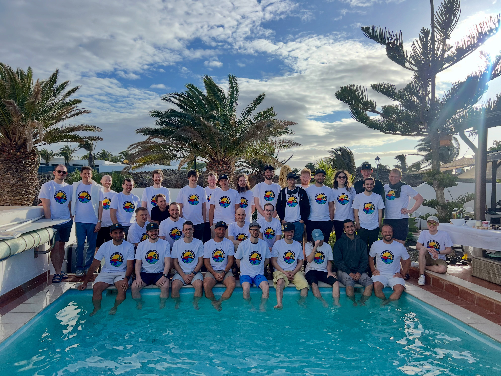

# Nix OceanSprint 2026

  
  

    

      
A week of Nix hacking, collaboration, and knowledge sharing in a beautiful seaside setting.

      

        <a href="https://app.formbricks.com/s/h6722ueqro6i4rdqbl5fxlyq" class="bg-white text-primary font-medium py-2 px-5 rounded-md hover:bg-gray-100 transition duration-200">
          Apply Now
        </a>
        <a href="/schedule/" class="border border-white text-white font-medium py-2 px-5 rounded-md hover:bg-white hover:bg-opacity-10 transition duration-200">
          View Schedule
        </a>
      

    

    

      

        

          <h3 class="font-medium text-white text-opacity-70 uppercase text-sm tracking-wider mb-1">When</h3>
          
<a href="https://calendar.google.com/calendar/render?action=TEMPLATE&text=Nix+OceanSprint+2026&dates=20260412/20260418&location=Lanzarote,+Canary+Islands&details=A+week+of+Nix+hacking+near+the+ocean" class="text-white hover:underline" target="_blank">12/04/2026 - 17/04/2026</a>

          
Sunday to Friday

        

        

          <h3 class="font-medium text-white text-opacity-70 uppercase text-sm tracking-wider mb-1">Where</h3>
          
Lanzarote, Canary Islands

          
<a href="https://house.niteo.co/" class="underline text-white hover:text-white">Oceanfront Villa with FTTH</a>

        

        

          <h3 class="font-medium text-white text-opacity-70 uppercase text-sm tracking-wider mb-1">Who</h3>
          
~30 Nix developers

          
All skill levels welcome

        

      

    

  

## Location

  

    <h3 class="font-medium text-gray-500 uppercase text-sm tracking-wider mb-1">Sprint Venue</h3>
    
<a href="https://maps.app.goo.gl/eoCiZ5YNsk9iyxWq7" class="text-primary">Niteo House, Costa Tequise, Lanzarote</a>

    
The sprint will take place outside under pavilion tents in a villa with a pool.

  

  

    
Within a 5 minute walk you can reach:

    <ul class="space-y-2 text-gray-600">
      <li>One of the best beaches in Lanzarote, where you can swim, jog, snorkel, SUP, surf and windsurf</li>
      <li>A local supermarket that is open every day from 8AM to 10PM</li>
      <li>A pharmacy and a bakery</li>
      <li>5km long beachside promenade with free outside gyms</li>
      <li>A steakhouse, a burger joint and an authentic Spanish tapas tavern</li>
      <li>An assortment of other various cafes, pubs and bars, restaurants, etc.</li>
    </ul>
  

  
  
  

## Accommodation

  

    <h3 class="font-medium text-gray-500 uppercase text-sm tracking-wider mb-1">Finding Your Stay</h3>
    
Once you are approved participant for the sprint, we'll get everyone to a shared communication room to help organize accommodation.

    
<i>Note: Accommodation is not covered by the sprint budget.</i>

  

  

    
If you are planning to come with your family and/or stay longer, <a href="https://twitter.com/nzupan" class="text-primary">Nejc Zupan</a> has written a <a href="https://github.com/zupo/awesome-lanzarote" class="text-primary">remote worker's guide to Lanzarote</a>.

    <a href="./accomodation/" class="text-primary text-sm">
      See Accommodation Suggestions →
    </a>
  

## Food

  

    

      <h3 class="font-medium text-gray-500 uppercase text-sm tracking-wider mb-1">During the Sprint</h3>
      
We'll organize catering (breakfast and lunch) during the sprint, which is paid by the sponsors.

    

    

      <h3 class="font-medium text-gray-500 uppercase text-sm tracking-wider mb-1">Evenings</h3>
      
There are a ton of options for dinners in nearby restaurants.

    

  

## Registration

  

    
Apply now to secure your spot for this collaborative coding event.

    

      <a href="https://app.formbricks.com/s/h6722ueqro6i4rdqbl5fxlyq" class="bg-primary text-white font-medium py-2 px-5 rounded-md hover:bg-primary-dark transition duration-200 inline-block">
        Fill Out Application Form
      </a>
    

  

## Topics

  
To be determined once registration closes based on attendees interest.

## Travel

  

    

      <h3 class="font-medium text-gray-500 uppercase text-sm tracking-wider mb-1">By Air</h3>
      
The best way to travel is <a href="https://www.flightconnections.com/flights-to-lanzarote-arrecife-ace" class="text-primary">via a plane to Lanzarote airport</a>.

      
Flights from other Canary Islands (Tenerife/Gran Canaria) are cheap. Flights from Madrid and Barcelona are even cheaper, around 20 EUR.

    

    

      <h3 class="font-medium text-gray-500 uppercase text-sm tracking-wider mb-1">Local Transport</h3>
      
From the Lanzarote airport you can take a taxi to the venue, they have a flat rate around 20-25 EUR.

      
<a href="https://autoreisen.com/" class="text-primary">Renting a car</a> is usually quite cheap, around 200-350 EUR for the week.

    

  

## Activities

  

    

      <h4 class="font-medium text-gray-800 mb-3">Water Activities</h4>
      <ul class="space-y-2 text-gray-600">
        <li>First-class <a href="http://www.watermanlanzarote.com/" class="text-primary">surfing</a></li>
        <li>Kitesurfing and windsurfing</li>
        <li>Wingfoiling</li>
        <li>Diving</li>
        <li>Sailing</li>
      </ul>
    

    

      <h4 class="font-medium text-gray-800 mb-3">Land Activities</h4>
      <ul class="space-y-2 text-gray-600">
        <li>Yoga</li>
        <li><a href="https://www.famaraiso.es/" class="text-primary">Paragliding</a></li>
        <li><a href="https://www.tripadvisor.com/Attractions-g187477-Activities-c61-t214-Lanzarote_Canary_Islands.html" class="text-primary">Cycling and mountain biking</a></li>
        <li>Volcano hiking</li>
      </ul>
    

    

      <h4 class="font-medium text-gray-800 mb-3">Cultural Experiences</h4>
      <ul class="space-y-2 text-gray-600">
        <li>Visit Timanfaya volcano & eat fish grilled on lava</li>
        <li><a href="https://en.wikipedia.org/wiki/C%C3%A9sar_Manrique" class="text-primary">Local culture</a></li>
        <li>Gastronomy</li>
        <li>Cave sightseeing</li>
      </ul>
    

  

  

    <a href="./activities/" class="text-primary">
      Explore all activities →
    </a>
  

## Sponsors

  

    <h3 class="font-medium text-gray-500 uppercase text-sm tracking-wider mb-3">Support the Event</h3>
    
We're looking for sponsors to cover expenses such as venue, catering, T-shirt printing and some of the activities.

    
Please help us make this a productive event by chipping in, so we can focus on coding instead of grocery shopping and cooking.

    
Our target budget is 15000 EUR. Reach out to <a href="mailto:sponsors@oceansprint.org" class="text-primary">sponsors@oceansprint.org</a>.

  

  

    

      <table class="min-w-full border-collapse">
        <thead>
          <tr class="border-b border-gray-200">
            <th class="pb-3 px-4 text-left text-xs font-medium text-gray-500 uppercase tracking-wider border-r border-gray-100">Level</th>
            <th class="pb-3 px-4 text-left text-xs font-medium text-gray-500 uppercase tracking-wider border-r border-gray-100">Contribution (EUR)</th>
            <th class="pb-3 px-4 text-left text-xs font-medium text-gray-500 uppercase tracking-wider">Perks</th>
          </tr>
        </thead>
        <tbody class="divide-y divide-gray-100">
          <tr>
            <td class="py-3 px-4 text-gray-900 border-r border-gray-100">Diamond</td>
            <td class="py-3 px-4 text-gray-700 border-r border-gray-100">8000</td>
            <td class="py-3 px-4 text-gray-700">Gold + Prominent logo placement, 4 total reserved seats, keynote mention, premium SWAG package.</td>
          </tr>
          <tr>
            <td class="py-3 px-4 text-gray-900 border-r border-gray-100">Gold</td>
            <td class="py-3 px-4 text-gray-700 border-r border-gray-100">4000</td>
            <td class="py-3 px-4 text-gray-700">Company + Large logo on the T-shirt, 2 total reserved seats, shoutout during dinner, SWAG.</td>
          </tr>
          <tr>
            <td class="py-3 px-4 text-gray-900 border-r border-gray-100">Company</td>
            <td class="py-3 px-4 text-gray-700 border-r border-gray-100">1500</td>
            <td class="py-3 px-4 text-gray-700">Individual + Logo on the T-shirt, company name on name tag + 1 reserved seat.</td>
          </tr>
          <tr>
            <td class="py-3 px-4 text-gray-900 border-r border-gray-100">Individual</td>
            <td class="py-3 px-4 text-gray-700 border-r border-gray-100">500</td>
            <td class="py-3 px-4 text-gray-700">Logo on the website.</td>
          </tr>
        </tbody>
      </table>
    

  

## Organizers

  

    

      
      

        <h4 class="font-medium text-gray-800 mb-1">Domen Kožar</h4>
        
Long time contributor to Nix, author of <a href="https://devenv.sh">devenv</a> and <a href="https://cachix.org/">Cachix</a>.

        <a href="https://github.com/domenkozar" class="text-primary text-sm">
          @domenkozar
        </a>
      

    

    

      
      

        <h4 class="font-medium text-gray-800 mb-1">Nejc Zupan</h4>
        
Recently converted Nix evangelist, author of <a href="https://paretosecurity.com/">Pareto Security</a>

        <a href="https://github.com/zupo" class="text-primary text-sm">
          @zupo
        </a>
      

    

  

